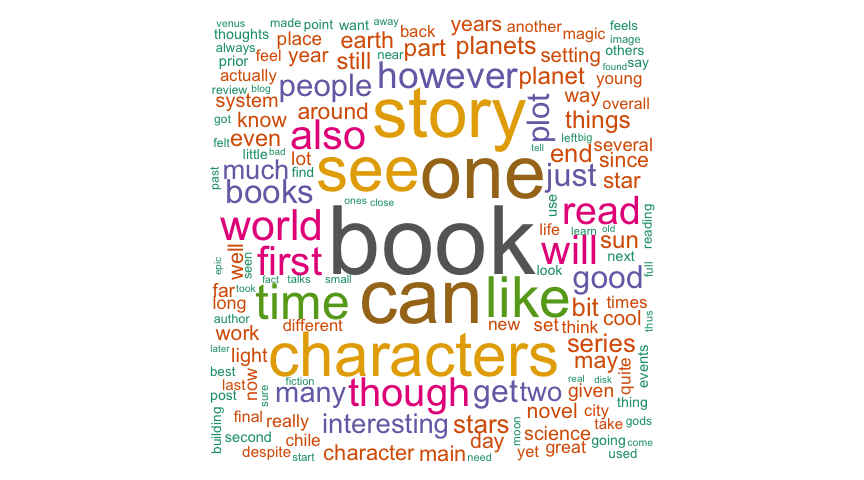

# Strakul’s Thoughts Data Analysis
David Rodriguez  
September 21, 2015  

This document contains example code and analysis for my blog, [Strakul's Thoughts](http://www.strakul.blogspot.com). You can find the full code at my [Github page](https://github.com/dr-rodriguez/BloggerAPI_R), and a text-heavy description of the results in my [August 30, 2015 blog post](http://strakul.blogspot.cl/2015/08/data-science-my-blog-with-r.html). 
This document is recent as of September 21, 2015 and so includes a little more updated information.

# Processing

First, I'll load the data set and all relevant packages.


```r
alldata <- readRDS(file='blogdata.Rda')

# Convert to data frame tbl
library(dplyr)
newdata <- tbl_df(alldata) 
rm('alldata')

library(stringi)
library(ggplot2)
library(scales) # for date_time scales
```

Then, I perform some basic processing to add extra information and count the number of words, images, characters.


```r
newdata <-
    newdata %>%
    mutate(title = as.character(title), 
           slabels = sapply(labels, toString), # collapse the labels list to a string
           monyear = factor(format(published,'%Y-%b')),
           published = as.POSIXct(published), #POSIXlt does not work with dplyr
           numimgs = stri_count_fixed(as.character(content),'', '', x) # removing HTML code encapsulated within <>
    x <- gsub('\n',' ',x) # removing newline characters
    x <- gsub('&nbsp;',' ',x) # removing some extra HTML code
    x <- gsub('\"','',x) # removing explicit quotation marks
    x
}
newdata <- 
    newdata %>%
    mutate(content=sapply(content,my_replace), #this can take some time
           numchar = nchar(content), #number of characters in post
           numwords = stri_count(as.character(content),regex='\\S+')) #number of words

# Add boolean columns for posts denoting them as Astronomy, Book, or Life in Chile related posts
newdata <- 
    newdata %>%
    mutate(books=sapply(labels, function(x) {any(x %in% 'Books')}),
           astronomy=sapply(labels, function(x) {any(x %in% 'Astronomy')}),
           chile=sapply(labels, function(x) {any(x %in% 'Life in Chile')}))
```

# Results

Here are the longests posts by number of words.


```r
 newdata %>%
    arrange(desc(numwords)) %>%
    select(title, numwords) %>%
        print(n=5)
```

```
## Source: local data frame [174 x 2]
## 
##                                                          title numwords
## 1                              A Journey to Northern Patagonia     3146
## 2          A Journey to Southern Patagonia and Tierra de Fuego     2453
## 3                      A Year as a Postdoc Astronomer in Chile     2038
## 4                            Marketing for Scientists Workshop     1947
## 5  Measuring the Distance to the Sun with the Transit of Venus     1851
## ..                                                         ...      ...
```

And here are the shortests posts by number of words.


```r
newdata %>%
    arrange(numwords) %>%
    select(title, numwords, numimgs) %>%
        print(n=5)
```

```
## Source: local data frame [174 x 3]
## 
##                             title numwords numimgs
## 1               Morning Mountains       42       1
## 2                   Fund Me Maybe       48       0
## 3       Chilean Sunrise: 3/7/2012       70       2
## 4  Chilean Anti-Sunset: 2/27/2012       76       1
## 5  Chilean Anti-Sunset: 1/18/2012       88       2
## ..                            ...      ...     ...
```

Here are top 5 posts with largest number of images.


```r
newdata %>%
    arrange(desc(numimgs)) %>%
    select(title, numimgs, numwords) %>%
        print(n=5)
```

```
## Source: local data frame [174 x 3]
## 
##                                                          title numimgs
## 1                              A Journey to Northern Patagonia      17
## 2          A Journey to Southern Patagonia and Tierra de Fuego      14
## 3  Measuring the Distance to the Sun with the Transit of Venus      13
## 4                           Iguazu Falls Trip: Argentina (1/3)      13
## 5                                Easter Island: Tourism! (3/3)      12
## ..                                                         ...     ...
## Variables not shown: numwords (int)
```

Now, I'll examine the frequency of posts by month and year. I also list the average number of words and images for each month. This is better seen in the graphs below.


```r
newdata %>%
    group_by(monyear) %>%
    summarize(counts=n(), mean_words=mean(numwords), mean_images=mean(numimgs)) %>%
    ungroup %>%
    arrange(desc(counts)) %>%
        print
```

```
## Source: local data frame [43 x 4]
## 
##     monyear counts mean_words mean_images
## 1  2012-Jan     16   725.9375    2.250000
## 2  2012-Apr     11   995.2727    4.181818
## 3  2012-Feb     11   950.7273    1.272727
## 4  2012-Mar     11   816.6364    4.272727
## 5  2012-Jun     10   754.1000    3.600000
## 6  2012-Aug      8   877.1250    2.625000
## 7  2012-Dec      6   812.8333    1.333333
## 8  2012-May      6  1196.1667    4.500000
## 9  2012-Jul      5  1051.6000    2.000000
## 10 2012-Sep      5   939.8000    1.000000
## ..      ...    ...        ...         ...
```

Now for some results regarding the type of posts I do. Here are the counts for the various combinations possible of posts related to books, astronomy, and life in Chile.


```r
newdata %>%
    group_by(books, astronomy, chile) %>%
    summarize(count=n()) %>%
    ungroup %>%
    arrange(desc(count)) %>%
        print
```

```
## Source: local data frame [7 x 4]
## 
##   books astronomy chile count
## 1  TRUE     FALSE FALSE    84
## 2 FALSE      TRUE FALSE    51
## 3 FALSE     FALSE  TRUE    19
## 4 FALSE     FALSE FALSE    10
## 5 FALSE      TRUE  TRUE     7
## 6  TRUE      TRUE FALSE     2
## 7  TRUE     FALSE  TRUE     1
```

Here are the top 5 longests posts that are not related to astronomy, book, or Chile.


```r
newdata %>%
    filter(!books,!astronomy,!chile) %>%
    select(title, slabels, numwords, numimgs) %>%
    arrange(desc(numwords)) %>%
    print(n=5)
```

```
## Source: local data frame [10 x 4]
## 
##                                        title                      slabels
## 1               Data Science: My Blog with R Data Science, Misc, Writting
## 2            How to Make 3D Images with GIMP               Misc, Pictures
## 3                 Avatar: The Last Airbender    Anime, Fantasy, TV series
## 4  Short Story: The Plane and the Calculator             Travel, Writting
## 5                   The Blog in Review: 2013               Misc, Writting
## ..                                       ...                          ...
## Variables not shown: numwords (int), numimgs (int)
```

Given that I write so many book-related posts, lets examine how many are classified under science fiction, fantasy, or are book club books.


```r
newdata %>%
    filter(books) %>%
    mutate(scifi=sapply(labels, function(x) {any(x %in% 'Science Fiction')}),
           fantasy=sapply(labels, function(x) {any(x %in% 'Fantasy')}),
           bookclub=sapply(labels, function(x) {any(x %in% 'Book Club')})) %>%
    group_by(scifi, fantasy, bookclub) %>%
    summarize(count=n()) %>%
    ungroup %>%
    arrange(desc(count)) %>%
        print
```

```
## Source: local data frame [7 x 4]
## 
##   scifi fantasy bookclub count
## 1 FALSE    TRUE    FALSE    39
## 2  TRUE   FALSE    FALSE    20
## 3 FALSE   FALSE     TRUE    11
## 4 FALSE   FALSE    FALSE     9
## 5 FALSE    TRUE     TRUE     3
## 6  TRUE    TRUE    FALSE     3
## 7  TRUE   FALSE     TRUE     2
```

For a more compact look, we can use the following code. 


```r
newdata %>%
    filter(books) %>%
    mutate(scifi=sapply(labels, function(x) {any(x %in% 'Science Fiction')}),
           fantasy=sapply(labels, function(x) {any(x %in% 'Fantasy')}),
           bookclub=sapply(labels, function(x) {any(x %in% 'Book Club')})) %>%
    group_by(scifi, fantasy, bookclub) %>%
    summarize(count=n()) %>%
    ungroup %>%
    mutate(allscifi=sum(scifi*count),
           allfantasy=sum(fantasy*count),
           allbookclub=sum(bookclub*count)) %>%
    select(allscifi:allbookclub) %>%
    unique %>%
        print
```

```
## Source: local data frame [1 x 3]
## 
##   allscifi allfantasy allbookclub
## 1       25         45          16
```

# Graphs

Now, we are ready to generate some graphs from our data.

First up is a histogram of when I published the data.

```r
# Setting the binwidth to be 30 days in seconds
bin <- 30*24*3600 

ggplot(newdata, aes(published, ..count..)) + 
    geom_histogram(fill='blue', col='white', binwidth=bin) +
    labs(x=NULL, y='Number of Posts') + 
    theme_bw() + 
    scale_x_datetime(breaks = "30 days",
                     labels = date_format("%Y-%b"),
                     limits = c(as.POSIXct("2012-03-01"),
                                as.POSIXct(Sys.Date())) ) +
    theme(axis.text.x = element_text(angle=90))
```

 

Here's a histogram of at what time I publish my posts.

```r
newdata <-
    newdata %>%
    mutate(times=strftime(published, '%T %z')) %>% # first as a character
    mutate(times=as.POSIXct(times, format='%T %z')) # now as a POSIXct date object

bin <- 3600 # seconds in an hour

ggplot(newdata, aes(times, ..count..)) + 
    geom_histogram(fill='darkred', col='white', binwidth=bin) +
    labs(x='Time of Day (CLT)', y='Number of Posts') + 
    theme_bw() + 
    scale_x_datetime(breaks = date_breaks("1 hour"),
                     labels = date_format("%H:%M"),
                     limits = c(as.POSIXct("00:00:00 -0300", format='%T %z'),
                                as.POSIXct("23:59:59 -0300", format='%T %z') )) +
    theme(axis.text.x = element_text(angle=90))
```

 

In the plot below, I examine the number of words in each post as a function of time


```r
lvls <- c(0,1,3,6,17)
cutlvls <- cut(newdata$numimgs, lvls, include.lowest = T)
ggplot(newdata, aes(published, numwords, col=cutlvls)) +
    geom_point(size=4) +
    coord_cartesian() + 
    labs(x='Date Published', y='Number of Words') + 
    scale_color_discrete(name='Number of Images', labels=c('0-1','2-3','4-6','7-17'))
```

 

The plot below shows what days I tend to publish my posts.


```r
newdata <-
    newdata %>%
    mutate(weekday=factor(weekdays(published))) # get the weekdays of my posts

summary1 <-
    newdata %>%
    group_by(weekday) %>%
    summarize(count=n())

# Manually setting the proper order and resetting the factors
lvls <- c('Sunday', 'Monday', 'Tuesday', 'Wednesday', 'Thursday', 'Friday', 'Saturday')
summary1 <-
    summary1 %>%
    mutate(weekday=as.character(weekday)) %>%
    mutate(weekday=factor(weekday, lvls))

ggplot(summary1, aes(weekday, count)) + 
    geom_bar(fill='darkgreen', col='white', stat="identity") +
    labs(x='Day of the Week', y='Number of Posts') + 
    theme_bw()
```

 

# Word Cloud

The last thing I want to do is create a word cloud of the top 200 words I've used in my posts.

First, I need to load up some more packages and process the data


```r
library(tm)
library(wordcloud)
library(RColorBrewer)

# Load up the data
textdata <- Corpus(VectorSource(newdata$content))

# Tidying up the text data
textdata <- tm_map(textdata, stripWhitespace)
textdata <- tm_map(textdata, content_transformer(tolower))
textdata <- tm_map(textdata, removeWords, stopwords("english"))
textdata <- tm_map(textdata, removePunctuation)
```

Now, we are ready to generate the word cloud. The cloud is square when embedded here, but when saved to a file it appears more circular.


```r
# Selecting the color palette from the RColorBrewer package
cols <- brewer.pal(8, "Dark2") # One of the better palettes for this

wordcloud(textdata, scale=c(6,0.2), max.words=200, random.order=F, 
          rot.per=0.1, use.r.layout=F, colors=cols)
```

 
